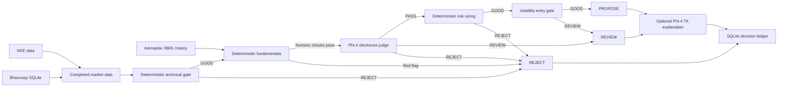

# NSE Stock Picker

A local NSE decision-support scanner that combines deterministic technical,
fundamental, risk, and volatility checks with a narrowly scoped LLM review of
qualitative disclosures.

The application produces `PROPOSE`, `REVIEW`, `REJECT`, or infrastructure
`FAILED` decisions. It does **not** connect to a broker or execute trades. Every
proposal requires human review.

## How it works



The main entry point is `ScanEngine.scan(ScanRequest) -> ScanResult`. The
production adapter in `nse_trade_graph.py` runs these stages:

1. Fetch the live quote, completed daily and 30/15/5-minute candles, benchmark
   history, and delivery participation.
2. Score technical evidence with deterministic code.
3. Run sector-aware numeric fundamental checks and a bounded qualitative
   disclosure review.
4. Size a possible position using allocation, maximum-loss, ATR-stop, target,
   and circuit constraints.
5. Reject unusually volatile entries or produce a manual trade proposal.
6. Optionally summarize the already locked TA evidence for displayed
   `PROPOSE`/`REVIEW` results; model failure retains the deterministic text.
7. Persist the typed decision, policy/model identity, timings, evidence, and
   scan accounting.

A failed symbol does not stop an index scan.

## Current decision policy

### Technical analysis

The live policy is `technical-relative-participation-v2`. It uses TA-Lib for:

- SMA20/SMA50 trend
- MACD(12, 26, 9) momentum
- RSI14 as a neutral-or-negative extreme penalty
- ATR14 for volatility and risk
- 20-session strength relative to the policy benchmark
- delivery-volume and price-confirmed market participation

Daily evidence carries at least as much weight as the combined intraday
evidence. Trend and momentum must both be engaged and positive; correlated
timeframes do not count as independent confirmations. RSI bands adapt to
ATR-based volatility. Invalid, incomplete, unfinished, or future-dated candles
cannot vote.

Policy parameters live in `technical_policies.json`, and every decision stores
the selected policy ID and configuration fingerprint.

For proposed or manually reviewed results, Phi-4 may summarize the immutable
`technical-explanation-input-v2` ledger after all decision routing has
finished. The ledger supplies preclassified family roles, timeframe conflicts,
daily price/volatility context, benchmark alignment, and delivery freshness.
The model cannot change the verdict, calculate thresholds, or add targets,
stops, chart patterns, or recommendations. Strict-output failure falls back to
the deterministic technical verdict.

### Fundamental analysis and the LLM

Fundamental processing reads a warmed material-disclosure and credit-rating
feed, then fetches corporate actions, peer data and integrated-financial XBRL;
shareholding history is read from Aerospike. Deterministic, sector-specific
code evaluates:

- multi-period coverage and earnings
- margins and leverage/cash conversion for non-financial companies
- asset quality and relevant banking/NBFC fields
- premium, surplus/operating profit, and shareholders' profit for life and
  general insurance XBRL taxonomies
- rating defaults, downgrades, negative watch and non-cooperation
- material defaults, fraud, insolvency, regulatory, auditor, litigation,
  management-exit and equity-dilution disclosures
- five-category shareholding trends across consecutive quarters
- evidence age and required-field coverage

Phi-4 is **not** asked to calculate ratios, score technical indicators, size
positions, or decide the final trade. Structured disclosure and rating actions
are evaluated before the model. It receives only bounded qualitative material
disclosures and corporate-action evidence with stable IDs. Its structured
response contains:

- `PASS`, `REVIEW`, or `REJECT`
- a controlled reason code
- a short summary
- validated evidence citations
- explicitly missing facts

Invalid model output fails closed to `REVIEW`. The selected local model is
`phi4:14b-q4_K_M` through Ollama/llama.cpp. On the retained versioned
qualitative-disclosure corpus it produced 25/26 exact verdicts, with no explicit
`REJECT` case incorrectly passed and one `REVIEW` case incorrectly passed.
That corpus is still small, so production decisions and future labeled cases
must continue to be reviewed.

### Risk and proposal

Defaults assume ₹100,000 principal, at most 10% capital in one position, and at
most 1% planned loss. The initial stop is two ATR below entry and the target is
2R above entry. Allocation, loss budget, invalid inputs, zero-share plans, and
exchange circuit proximity can all prevent a proposal.

The resulting text states entry, quantity, stop loss, target, capital, planned
maximum loss, and planned profit. It remains a proposal only.

## Setup

Requirements:

- Python 3.14 or newer
- `uv`
- Ollama with the selected Phi-4 model
- Docker Compose for Aerospike Community Edition

```bash
uv sync
cp .env.example .env
ollama pull phi4:14b-q4_K_M
```

Set the local backend in `.env`:

```dotenv
USE_LOCAL_LLM=1
LOCAL_LLM_URL=http://localhost:11434/v1
LOCAL_LLM_MODEL=phi4:14b-q4_K_M
LOCAL_LLM_REASONING_EFFORT=none
TECHNICAL_LLM_SUMMARY_ENABLED=0
TECHNICAL_LLM_MAX_TOKENS=600
```

The stub backend is used when neither local nor Anthropic execution is enabled.
The local backend takes precedence if both are enabled.

## Start the application

One command starts Aerospike, starts Ollama if it is not already available,
checks that the configured model is installed, and launches the persistent
background scheduler:

```bash
./nse_app.sh start
```

On its first run, the scheduler immediately performs a resumable bhavcopy
backfill. After that it records successful IST occurrence IDs in
`.app_scheduler_state.json`, so restarting the application does not duplicate
completed work.

```bash
./nse_app.sh status
./nse_app.sh logs
./nse_app.sh stop
./nse_app.sh restart
./nse_app.sh down
```

`stop` stops only the scheduler. `down` also stops the Aerospike container and
an Ollama process started by this script; the Aerospike data volume is retained.
Run `./nse_app.sh start` once after a machine reboot.

Jobs execute one at a time to preserve slow NSE access:

| Job | Default schedule |
|---|---|
| Bhavcopy catch-up | At startup, then at 19:00 IST after the nominal publication cutoff |
| NIFTY TOTAL MKT XBRL backfill | 16:00 IST weekdays, 25 due symbols |
| Queued XBRL shareholding warm | 17:00 IST weekdays, up to 100 symbols |
| Material disclosure/rating warm | 17:30 IST weekdays, 100 due symbols |
| Integrated governance warm | 17:45 IST weekdays, 25 due symbols |
| Document research warm | 18:00 IST weekdays, 10 due symbols |
| Paper-outcome update | 18:30 IST weekdays |
| Overnight scan and digest | 22:00 IST weekdays |
| Intraday actionable-symbol recheck | Every 20 minutes during NSE market hours |
| Runtime cleanup | 02:00 IST daily |

Failures retry after 30 minutes. Successful jobs run once per occurrence even
across restarts. `./nse_app.sh run-once` runs whatever is due and exits;
`foreground` is available for debugging.

On macOS, install the TA-Lib C library before `uv sync` if a compatible wheel
is unavailable:

```bash
brew install ta-lib
TA_LIBRARY_PATH="$(brew --prefix ta-lib)/lib" \
TA_INCLUDE_PATH="$(brew --prefix ta-lib)/include" \
uv sync
```

## Prepare source data

Delivery trends require recent whole-market bhavcopy history:

```bash
# Resumable, paced backfill of the latest 30 trading sessions
./backfill_bhavcopy.sh

# Add the current session after NSE publishes it
uv run bhavcopy.py
```

Shareholding trends are read from Aerospike during live scans. Warm missing XBRL
outside market hours:

```bash
uv run warm_shareholding.py FEDERALBNK
uv run warm_shareholding.py --index "NIFTY NEXT 50"
uv run warm_shareholding.py --queued
```

The automated scheduler also maintains a durable `NIFTY TOTAL MKT` registry:

```bash
uv run warm_shareholding.py \
  --universe-index "NIFTY TOTAL MKT" \
  --limit 25
```

This refreshes current index membership, resumes with the oldest never-warmed
or stale members, and marks successful symbols complete. Removed constituents
become inactive in the registry, but their historical filing records are not
deleted. With 25 symbols per weekday, the initial 750-symbol pass takes about
30 scan days. Completed symbols become eligible for a new-filing check after
30 days, so new quarterly filings are incorporated without discarding the raw
history. Empty or incomplete five-quarter histories are recorded separately
and retried after seven days; they are never reported as fully backfilled.

The warmer deliberately paces NSE requests, stores immutable compressed source
XML with checksums, and derives normalized quarterly records. A live scan never
downloads missing shareholding history; it returns `REVIEW` and queues the
symbol for later warming.

Material announcements and structured credit-rating actions are also warmed
outside scans:

```bash
uv run warm_disclosures.py BAJFINANCE
uv run warm_disclosures.py \
  --universe-index "NIFTY TOTAL MKT" \
  --limit 100
```

The feed uses a bounded lookback window, filters routine notices before they can
displace material evidence, and keeps stable evidence IDs plus NSE source
provenance. A live scan never calls either disclosure endpoint.

Integrated Filing - Governance XBRL is warmed the same way. Ordinary director
rotation is ignored; only structured exceptions such as committee non-compliance,
pending investor grievances, disclosed violations, and cyber-security incidents
become deterministic review evidence. Promoter pledge/encumbrance values from
shareholding XBRL are retained with quarter-over-quarter and four-quarter changes.

```bash
uv run warm_governance.py RELIANCE
uv run warm_governance.py \
  --universe-index "NIFTY TOTAL MKT" \
  --limit 25
```

A live scan never downloads governance filings inline. Missing optional
governance coverage produces a compact Slack note, not a false `REJECT`.

Annual reports, investor presentations, and earnings transcripts/concalls are
warmed into a document-research cache with checksums and page provenance.
Deterministic regex extraction builds the fact ledger; numeric values never
enter the verdict from free-form LLM output alone. Live scans read only warmed
facts.

```bash
uv run warm_document_research.py HDFCBANK
uv run warm_document_research.py \
  --universe-index "NIFTY NEXT 50" \
  --limit 10
```

## Run scans

```bash
# NSE_SYMBOL from .env
uv run nse_trade_graph.py

# One or more explicit symbols
uv run nse_trade_graph.py RELIANCE
uv run nse_trade_graph.py ACE HDFCBANK TITAN SBICARD TECHM
uv run nse_trade_graph.py RELIANCE,ACE,HDFCBANK

# An index, optionally limited for a staged validation
NSE_INDEX="NIFTY NEXT 50" NSE_SCAN_LIMIT=10 uv run nse_trade_graph.py
NSE_INDEX="NIFTY MIDCAP 50" NSE_SCAN_LIMIT=5 uv run nse_trade_graph.py
```

Use `NSE_SCAN_DELAY_SECONDS` and the per-source delay settings in `.env` to keep
NSE access slow. Completed-candle handling and the 15-minute post-close grace
period are based on IST regardless of the host timezone.

## Alerts and scheduled operation

`digest.py` sends a run digest through enabled email and Slack channels:

```bash
uv run digest.py <scan_label>
```

`intraday_recheck.py` rechecks only actionable symbols from the latest overnight
run and sends an alert when disposition, reason, entry, stop, target, or quantity
materially changes:

```bash
uv run intraday_recheck.py [scan_label]
```

It self-gates to NSE market hours and keeps per-channel deduplication in
`.intraday_alert_state.json`. `NSE_SKIP_MARKET_HOURS_CHECK=1` is for manual
testing only.

The full overnight workflow refreshes bhavcopy, updates paper outcomes, scans
`NSE_OVERNIGHT_INDEX` (default `NIFTY NEXT 50`), and sends the digest:

```bash
./run_overnight_scan.sh
```

Email and Slack remain disabled until `EMAIL_ENABLED=1` or `SLACK_ENABLED=1`
and their credentials are configured in `.env`.

## Runtime storage

| Store | Purpose | Lifecycle |
|---|---|---|
| `.cache/` | Short-lived market, fundamental, material-disclosure, governance, and document-research snapshots | Disposable; TTL cleanup |
| `bhavcopy.db` | Whole-market daily OHLCV and delivery history | Retained source data |
| Aerospike `shareholding` set | Raw and normalized XBRL shareholding history | Retained source data |
| Aerospike `shareholding_warm` set | Symbols queued for background warming | Disposable work queue |
| Aerospike `shareholding_universe` set | Persistent index membership and per-symbol backfill progress | Durable scheduler state |
| `evaluation.db` | Immutable scan decisions, run membership, and paper outcomes | Durable derived ledger |
| `trade_log.jsonl` | Append-only recovery/digest feed | Retained for a bounded period |
| `scan_runs.jsonl` | Batch crash-recovery journal | Retained for a bounded period |
| `.intraday_alert_state.json` | Material-transition and channel deduplication | Retain while alerts are active |
| `.app_scheduler_state.json` | Last attempt/success for each scheduled occurrence | Retain to prevent duplicate work |
| `cron.log` | Scheduled-job output | Size bounded |

Do not routinely delete `bhavcopy.db` or the Aerospike volume: they are expensive
source histories, not transient caches. `evaluation.db` can be reset only when
old decisions are no longer comparable with the current policy/model.

## Data cleanup

Audit local artifacts without changing anything:

```bash
uv run cleanup.py audit
```

Preview routine cleanup:

```bash
uv run cleanup.py all --skip-eval-results
```

Apply it:

```bash
uv run cleanup.py --apply all --skip-eval-results
```

The applied command removes expired cache files and development caches,
compacts old JSONL records into `.archive/`, and bounds `cron.log`. The explicit
skip preserves the final model evaluation baselines. Defaults are:

- cache retention: 48 hours
- JSONL retention: 90 days
- cron log cap: 5 MB

Override them with `CLEANUP_CACHE_MAX_AGE_HOURS`,
`CLEANUP_JSONL_RETENTION_DAYS`, and `CLEANUP_CRON_LOG_MAX_MB`.

## Evaluation

Decisions are paper/reference observations, not fills or a production
backtest. Update outcomes after new completed bhavcopy sessions:

```bash
uv run evaluation.py update
uv run evaluation.py report
```

If SQLite was unavailable during a scan, import the JSONL fallback
idempotently:

```bash
uv run evaluation.py import-jsonl
```

Outcomes use future exchange sessions only, apply an explicit round-trip cost,
handle gap-through stops conservatively, and retain the evaluation methodology
identity. Raw bhavcopy is not corporate-action adjusted.

Before changing the qualitative prompt or model, rerun the versioned LLM corpus:

```bash
uv run run_llm_eval.py --output evals/results/current.json
```

See `evals/README.md` for the corpus provenance, scoring rules, retained Phi-4
baseline, and inference benchmark.

## Configuration

Copy `.env.example`; it documents every setting. The important groups are:

- model: `USE_LOCAL_LLM`, `LOCAL_LLM_URL`, `LOCAL_LLM_MODEL`,
  `FUNDAMENTAL_LLM_MAX_TOKENS`, `TECHNICAL_LLM_SUMMARY_ENABLED`,
  `TECHNICAL_LLM_MAX_TOKENS`
- scan: `NSE_SYMBOL`, `NSE_INDEX`, `NSE_SCAN_LIMIT`,
  `NSE_SCAN_DELAY_SECONDS`, `NSE_OVERNIGHT_INDEX`,
  `NSE_OVERNIGHT_SCAN_LIMIT`
- automation: `APP_ENABLE_*`, `APP_*_TIME_IST`,
  `APP_INTRADAY_INTERVAL_MINUTES`, `APP_XBRL_WARM_LIMIT`,
  `APP_XBRL_UNIVERSE_INDEX`, `APP_XBRL_UNIVERSE_BATCH_SIZE`,
  `APP_XBRL_UNIVERSE_REFRESH_DAYS`,
  `APP_SCHEDULER_RETRY_MINUTES`
- policy: `NSE_TECHNICAL_POLICY_ID`, `NSE_POLICY_VERSION`
- risk: `NSE_PRINCIPAL`, `NSE_MAX_ALLOCATION_PCT`,
  `NSE_MAX_LOSS_PCT`, `NSE_ATR_STOP_MULTIPLE`,
  `NSE_REWARD_RISK_RATIO`
- source pacing/cache: `NSE_CALL_DELAY_SECONDS`,
  `FUNDAMENTALS_CALL_DELAY_SECONDS`,
  `FINANCIAL_RESULTS_CALL_DELAY_SECONDS`,
  `NSE_XBRL_CALL_DELAY_SECONDS`, `CACHE_DIR`
- persistence: `BHAVCOPY_DB_PATH`, `EVALUATION_DB_PATH`,
  `TRADE_LOG_PATH`, `AEROSPIKE_*`
- notifications: `EMAIL_*`, `SLACK_*`,
  `INTRADAY_ALERT_STATE_PATH`

Bump `NSE_POLICY_VERSION` whenever model, prompt, technical, fundamental, or
risk semantics change so evaluation cohorts remain comparable.

## Tests

```bash
uv run python -m unittest discover -s tests
```

The original `loop_agent.py` and `graph_agent.py` remain as small control-flow
examples. The production application is the typed scan engine described above.

This software is experimental decision support, not investment advice.


